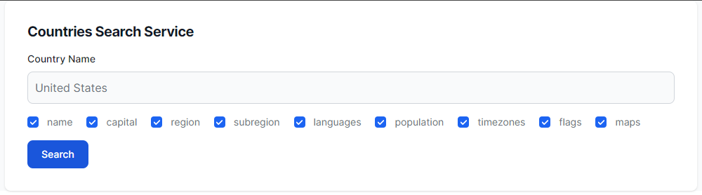

# CS569 Homework
Create an Angular application that uses the [REST Countries API](https://restcountries.com/) to search for countries by name, and the ability to customize the response fields by (`name, capital, region, subregion, languages, population, timezones, flags, maps`). All these fields are selected by default. Request example: `GET https://restcountries.com/v3.1/name/{name}?fields={field},{field},{field}`

  

